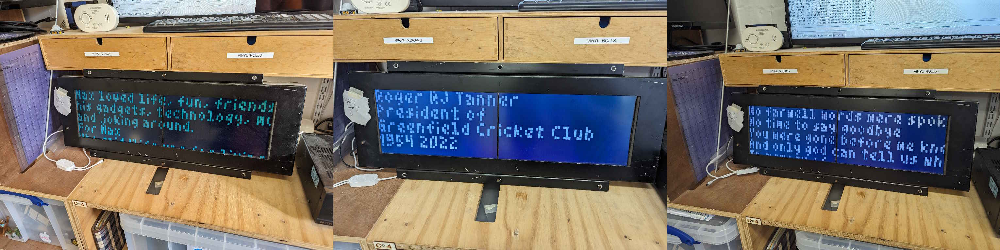

# OpenBenches Train Sign

Displaying the most recent bench from <https://openbenches.org/> on a 96ⅹ26 [train sign].

There are three parts

- (transformer) a script to turn the [OpenBenches RSS Feed] into the text for the most recent bench
- (fetcher) an ESP8266 microcontroller to fetch the latest bench, and push it over I2C
- (controller) an Arduino to control the text on the sign, and listen on I2C for new text to display

[train sign]: https://github.com/sheffieldhackspace/train-signs
[OpenBenches RSS Feed]: https://openbenches.org/feed

## Transformer

These are a few CGI scripts in [`./transformer/](./transformer/), which I host on a server, currently at these endpoints:

- <https://server.alifeee.co.uk/bench/line.cgi>
- <https://server.alifeee.co.uk/bench/full.cgi>

## Fetcher

This is code to flash an ESP8266, in [`./fetcher/`](./fetcher/).

To program the ESP, use [Platform IO for VSCode](https://docs.platformio.org/en/latest/integration/ide/vscode.html) or another method. To use PlatformIO, you must use VSCode.

Copy the example secrets file ([`./fetcher/src/secrets.example.h`](./fetcher/src/secrets.example.h)) and enter your Wi-Fi details, and the URL of the file to fetch (i.e., <http://server.alifeee.co.uk/bench>).

## Controller

This is code to flash an Arduino Uno, in [`./controller/`](./controller/).

It uses Serial communication to listen for messages, which are then displayed on the train sign.

For more information on this see the [train sign] repository.
